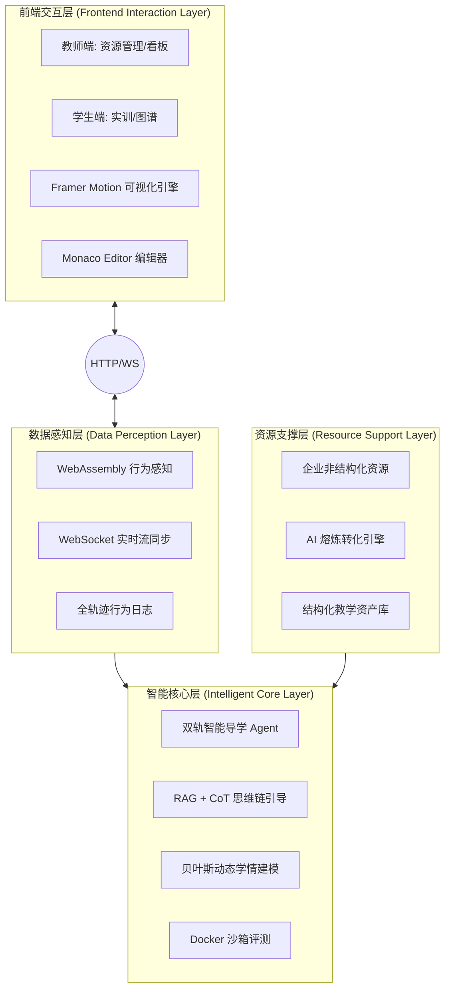
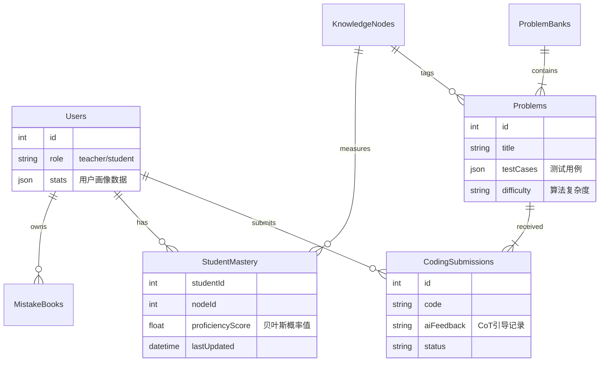

# EduCode AI 课程智能体系统项目开发文档

## 1. 项目简介 

**项目名称**：EducodeAI —— 智能实训系统
**项目定位**：本系统作为《AI 赋能的软件技术类实训智能体开发与应用模式研究》课题的技术落地载体，旨在构建一款“以产促教、以智导学”的智能化实训平台。
**核心理念**：

*   **资源转化范式**：构建“企业—AI—教学”协同的资源转化范式，解决产业资源转化难题。
*   **双轨引导—数据闭环**：创建“技能实操即时反馈+工程思维支架引导”的双轨机制，形成“感知-引导-反馈-优化”的闭环生态。

本项目依托国产大模型（DeepSeek/Qwen）作为技术引擎，以天津滨海迅腾科技有限公司真实产业资源为底座，解决传统教学中“资源转化难、思维引导弱、个性化缺失”的三大痛点。

## 2. 技术架构 

本项目采用前后端分离的现代化全栈架构，坚持“自主可控、轻量部署”的原则。

## 2. 技术架构 

本项目执行“四层一体、双端协同”的技术架构体系，坚持“底座自主、交互精细、部署轻量”的原则。

### 2.1 前端交互层 
*   **技术栈**：React 18 + TypeScript + Tailwind CSS
*   **核心功能**：
    *   **沉浸式实训**：基于 **Monaco Editor** 提供类 VS Code 的工业级开发体验。
    *   **动态图谱渲染**：利用 **Framer Motion** 引擎，将学生认知状态转化为交互式星系/节点图谱，实现可视化的学情导航。

### 2.2 智能核心层 
*   **技术栈**：Node.js (Express) + Python (AI Service)
*   **功能定位**：系统的“大脑”，承担推理与评价职能。
    *   **双轨引导**：集成 **RAG (检索增强生成)** 与 **CoT (思维链)** 技术，生成“支架式”分层提示，而非直接给出答案。
    *   **学情建模**：基于 **贝叶斯推断** 算法，动态量化更新学生的能力状态。
    *   **自动化评测**：利用 **Docker** 容器技术，提供安全隔离的代码自动化评测与运行环境。

### 2.3 数据感知层 
*   **技术栈**：WebAssembly (Rust/C++) + WebSocket
*   **功能定位**：实现无侵入式的全轨迹数据采集。
    *   **实时感知**：利用 **WebAssembly** 在浏览器端毫秒级捕捉代码编辑行为与AST演进。
    *   **数据同步**：通过 **WebSocket** 全双工通道，实现端云数据的实时流转。

### 2.4 资源支撑层 
*   **核心组件**：AI 熔炼引擎 + MySQL/Redis
*   **功能定位**：产教资源的转化与供给枢纽。
    *   **AI 熔炼**：构建非结构化文档解析引擎，将滨海迅腾的企业真实案例“熔炼”为标准化的教学题库与实训指导书。

## 3. 功能模块详解 

### 3.1 教师端：资源转化与教学闭环
核心目标：实现“企业提供项目—AI 结构解析—教学适配—实训应用”的资源建设路径。

*   **AI 自动化录题与资源转换模块 **
    *   **核心功能**：作为 **[AI 熔炼引擎]** 的前端入口，支持上传 Word/PDF 格式的企业技术文档。
    *   **智能解析**：自动识别业务逻辑、提取代码块，并利用 Tagging Agent 进行知识点打标，一键生成结构化题库。
*   **全景教学看板与学情诊断**
    *   **班级画像**：展示代码提交活跃度、通过率等宏观数据。
    *   **自动诊断**：基于学生的过程性数据，自动生成班级诊断报告，辅助教师进行精准干预。

### 3.2 学生端：双轨引导与个性化导航
核心目标：构建“感知-引导-反馈-优化”的智能学习闭环。

*   **智能编程工作台**
    *   **双轨 AI 助教**：
        1.  **技能实操反馈**：基于 Wasm 实时检测语法错误与运行异常。
        2.  **工程思维支架**：基于 **RAG + CoT**，当学生遇到逻辑瓶颈时，提供“思路提示 (Hint)”而非直接代码，引导学生分步解决问题。
*   **全景动态知识图谱**
    *   **可视化导航**：以星系图形式展示知识点拓扑结构。
    *   **状态实时更新**：基于 **贝叶斯模型**，根据实时实训结果动态改变节点颜色（灰/蓝/金）与呼吸频率，直观反馈掌握程度。
*   **个人成长中心**
    *   **多维画像**：展示技能雷达图、每日代码热力图及数字徽章。
    *   **智能推荐**：根据当前能力短板，自动推送企业案例库中的针对性强化任务。

---

## 4. 数据库设计 

系统采用 MySQL 存储核心业务数据，通过精心设计的 E-R 关系支撑“产教协同”与“智能导学”的复杂业务逻辑。

| 数据表名称 (Table) | 用途说明 | 关键字段 (Fields) | 对应科研模块 |
| :--- | :--- | :--- | :--- |
| **Users** | 用户表 | role, avatar, stats | **[学情画像]** 基础数据 |
| **Problems** | 题目表 | difficulty, tags, testCases | **[资源转化]** 成果库 |
| **ProblemBanks** | 题库表 | ownerId, problems (JSON) | 校本/企业案例库 |
| **CodingSubmissions** | 提交记录表 | code, status, aiFeedback | **[数据闭环]** 过程性评价 |
| **KnowledgeNodes** | 知识图谱节点 | relations (Json/Relation) | **[图谱导航]** 拓扑结构 |
| **StudentMastery** | 学生掌握度 | proficiencyScore, lastUpdated | **[贝叶斯模型]** 状态存储 |
| **MistakeBooks** | 错题本 | errorType, aiAnalysis | 错误归因分析库 |

---

## 5. 核心创新点与技术关键 

本项目在技术实现上深度贯彻《课题申报书》的创新要求，具体体现在：

### 5.1 两大核心创新
1.  **AI 熔炼实训资源生产新范式**
    *   **创新实质**：利用国产大模型作为“熔炉”，构建全自动化的非结构化工程资源转化引擎。
    *   **解决痛点**：突破传统人工录题瓶颈，实现从“产业原始素材”向“标准化实训资产”的生成式跳跃。
2.  **“双轨引导-数据闭环”的智能实训教学新生态**
    *   **创新实质**：首创“技能实操(Wasm) + 工程思维(RAG)”双轨并行机制。
    *   **解决痛点**：将 AI 从单纯的答案生成工具升级为“苏格拉底式”导师，有效防止学生产生依赖，构建“感知-引导-反馈-优化”闭环。

### 5.2 三大技术关键点
*   **语义降维技术**：通过 **Prompt Engineering** 准确拆解企业级业务逻辑为高职适用的知识点序列。
*   **支架式边界控制**：在 **RAG** 检索中植入教学法约束，严格控制 AI 回复深度，掌握教学“分寸感”。
*   **实时图谱渲染**：利用 **WebAssembly** 与 **Framer Motion**，在高并发下实现毫秒级的图谱状态更新。

