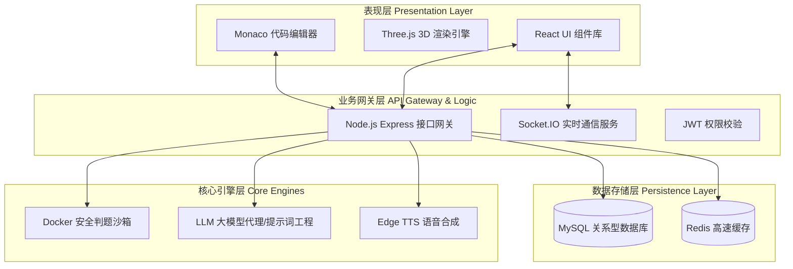
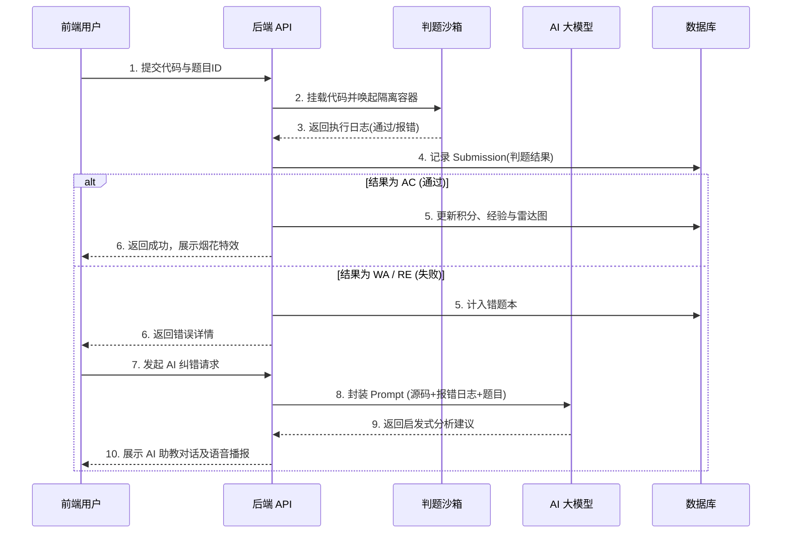

# EduCode 智教编程系统 - 概要设计说明书

## 1. 系统概述
EduCode 是一款融合了大语言模型（LLM）与 WebGL 游戏化渲染引擎的现代化“一站式在线编程辅助教学系统”。系统致力于解决传统在线评测系统（OJ）反馈生硬、学情追踪浅薄等痛点，提供代码安全沙箱判题、AI 智能启发式纠错、3D星际通关与多维能力建模等核心服务。

## 2. 系统总体架构设计
本系统采用 **前后端分离** 结合 **微服务思想** 的分层架构，自上而下分为四层：表现层、业务网关层、核心引擎层与数据存储层。

### 2.1 表现层 (Presentation Layer)
采用 React 19 + TypeScript + Vite 驱动。
* **游戏化视觉**：基于 `@react-three/fiber` 和 `drei` 提供 3D 宠物模型、星盘关卡的渲染。
* **交互体验**：集成 Monaco Editor 提供类 VSCode 的丝滑编码体验，采用 TailwindCSS 实现现代化拟态界面。

### 2.2 业务逻辑层 (Business Logic Layer)
采用 Node.js + Express 架构。
* 负责路由分发、JWT 身份鉴权、请求限流（Rate Limiting）。
* 维护 `Socket.IO` 长连接，用于实现全站通知广播、判题进度实时推送。

### 2.3 核心引擎层 (Core Engines Layer)
* **判题沙箱**：系统的心脏。每当用户提交代码，系统动态唤起临时 Docker 容器，挂载文件并执行编译与测试用例，实施严格的 CPU 时间与内存限制，执行完毕后容器自毁，保障宿主机绝对安全。
* **AI 导学引擎**：通过接入 Google GenAI 或 OpenAI 大语言模型，结合特定 Prompt，对沙箱抛出的异常日志与用户代码进行上下文理解，输出启发式的中文引导。

### 2.4 数据存储层 (Data Storage Layer)
* **MySQL 8.0**：核心结构化数据存储引擎，配合 Sequelize ORM 映射对象。
* **Redis**：用作全站排行榜（Leaderboard）缓存、请求限流记录，以及高并发下的判题队列缓冲。

---

## 3. 功能模块划分

系统按业务边界划分为四大核心模块：

### 3.1 题库与星盘模块
* **题目管理**：支持教师对 Markdown 题干、输入输出限制（时间和空间复杂度）以及测试数据样例的 CRUD 操作。
* **星盘通关**：将题目结构化为不同的星系节点，必须完成前置节点（或获得足够积分）才可解锁后续高难度知识点。

### 3.2 沙箱评测模块 (Judge Module)
* **执行调度**：接收前端代码提交，通过排队机制（FIFO）控制并发容器数量。
* **判题反馈**：实时比对标准输出与用户输出，返回 `AC` (通过)、`WA` (答案错误)、`TLE` (超时)、`RE` (运行错误) 等标准 OJ 状态码。

### 3.3 AI 智能助教模块
* **秒级智能纠错**：当状态非 AC 时，提供一键求助 AI 接口，返回高亮修正建议与算法思路。
* **语音双向交互**：支持通过 Web Speech API 进行麦克风收音（STT），并将 AI 回复通过 Edge TTS 转化为“温馨海狸”或“桃光精灵”的专属角色声线播放。

### 3.4 学情追踪模块
* **多维雷达与积分**：基于题目 Tags，动态更新学生的六维编程能力雷达图；AC 题目实时增加平台积分与经验值。
* **错题本与总结**：自动收录错题，支持 AI 基于错题本生成周期性的个性化学习周报。

---

## 4. 核心业务数据流图（判题与 AI 纠错）

